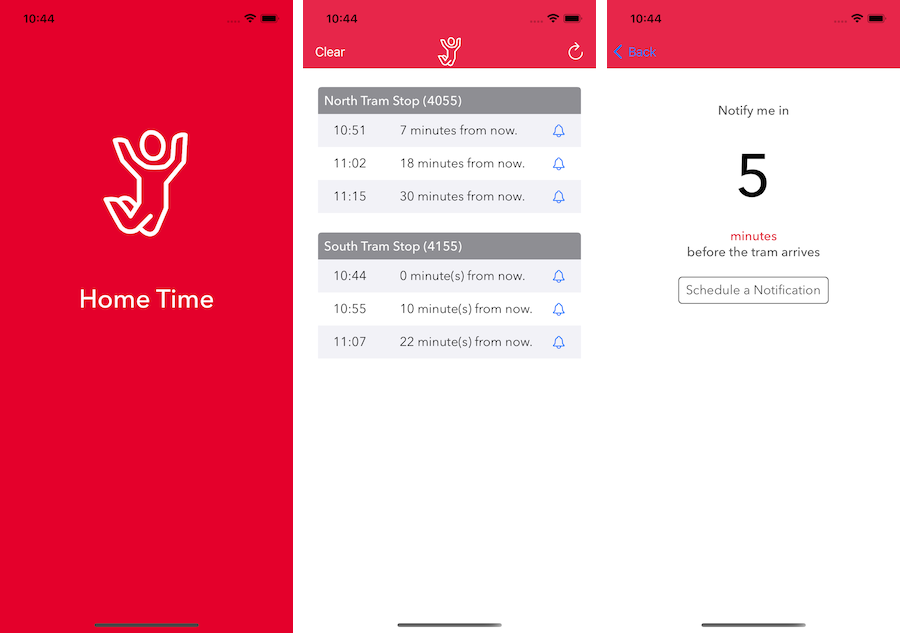
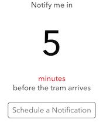

<p align="center"></p>

# Home Time

> A coding challenge for recruiting potential devs for REA.

Home Time is a an app challenge given to potential mobile dev candidates for REA. It is created in response to a problem statement supplied by REA.

The app is designed to notify employees of REA when a tram is coming to the north or south tram stops out the front of 511 Church St., Richmond. The numbers of each tram stop are provided, as are API details and a function to convert UNIX/POSIX strings into Swift Date types.

## Problem Statement

Thanks to all the perks available at the office. It becomes very easy to forget it’s time to catch a tram. As such, REA employees have requested a mobile app that would tell them when trams are arriving at either north or south bound tram stops in front of the office.

The company has reached out to their mobile experts (you) for a solution, that should not only be user friendly but also maintainable & scalable!

## Features

- [x] Obtains the next 3 expected arrival times from the Tram Tracker API for both north and south bound tram stops
- [x] Enables the user to schedule a local notification for a user defined number of minutes before the tram is due to arrive.
- [x] Written in Swift5 and modern app development practices including Storyboards and Auto Layout. 
- [x] Uses REA colour pallette and certain design elements
- [x] Custom icon and logo!


## UI/UX Considerations

To address the problem statement several UI and UX considerations were made:

- As the app by default loads the tables with data when launched the "Load" button was replaced with a "refresh" icon which refreshes both tables with data from the API.
<p align="center"></p>

- In addition to showing the times for the next 3 trams, the app conveniently calculates the time difference in minutes between now and when the tram comes to give the user a deeper understanding for just how long they have got until the next tram. (eg. 16:04  5 minutes from now.
<p align="center"></p>

- Whilst not explicitly called for, the problem statement clearly mentions the app needs to assist in informing staff about trams arriving. To help in this, the app allows the user to tap a tram time and set up a local notification that triggers in minutes before the tram arrives. The amount of warning defaults to 5 mins but may be adjusted by the user. Once a notification has been set and if the app in no longer in the foreground (or phone is locked) a local notification will be triggered at the set time to warn the user. Notifications are also sent to Apple Watch if the user has one paired with the phone.
<p align="center"></p>

- The "Clear" button was asked for in the brief and shown on the sample UI provided in the Problem Statement. Whilst this functionality has been programmed, the developer of this app does not understand the intention behind it but has implemented it regardless.

## Requirements

- iOS 14.0+
- Xcode 12.0+

## Installation

Configuring the Xcode project requires a few steps in Xcode to get Home Time up and running. 


1) Configure the Team for each target within the project.

Open the project in the Project navigator within Xcode and select each of the targets. Set the Team on the General tab to the team associated with your developer account.


2) Change the Bundle Identifier.

With the project's General tab still open, update the Bundle Identifier value. The project's Home Time target ships with the value:

com.deadfrogstudios.Home-Time

You should modify the reverse DNS portion to match the format that you use:

com.yourdomain.Home-Time


3) Ensure Automatic is chosen for the Provisioning Profile setting in the Code Signing section of Target > Build Settings for the following Targets:

- Home Time


4) Ensure iOS Developer is chosen for the Code Signing Identity setting in the Code Signing section of Target > Build Settings for the following Targets:

- Home Time


## Notable Coding Features

- Home Time makes use of a custom made generic API manager that is responsible for retrieving data and decoding JSON after retrieval. Seperate classes are then made for the token and tram data that are responsible for forming the URL and defining the JSON structure of the expected response object.

- The function ```dateFromDotNetFormattedDateString``` was added an as extension to ```String``` to facilitate code reuse. Several extensions were added to ```Date``` and ```UserDefaults``` to provide quick convenience in formatting and storing data.

- The device token is retrieved when the app first starts and is stored in UserDefaults for subsequent API calls.

- Home Time uses modern app development practices including Storyboards and Auto Layout.

- Note also that ```TramTimeTableViewController``` does not contain UITableview delegate and datasource methods. These have been extracted out into their own dedicated classes that provide data for each table. This leaves the code in the view controller dedicated to UI and UI interaction and modularises the appraoch to providing data to the table.

- Also included in the project are 2 subclassed UIKit (UIbutton and UIView) controls that are IBDesignable. These provide some UI sugar and can be configured in Storyboards visually.

## Assessment Criteria

The assessment criteria for us are as follows:
- [x] Knowledge of chosen development language (Swift5 was used throughout and no packages or external depencies are used. Networking activity implemented using only UrlSession)
- [x] Design and Architecture – OOP, Functional Programming, etc. (App was designed to decouple view controllers and data sources. Use of extensions to reuse code and a flexible API model)
- [ ] Testing – Unit tests, Integration tests, etc. (Unit tests not provided at the time....I know...:sad panda:)
- [x] Documentation – A good README file, comments in the code, etc. (Have you even seen the beauty in this README? It's like the Mona Lisa of README files. Code comments appear where relevant and value added.

## Contribute

We would love you to contribute to Home Time. Pull requests are welcome.

## Meta

Jason van Lint – jason.vanlint@reagroup.com

